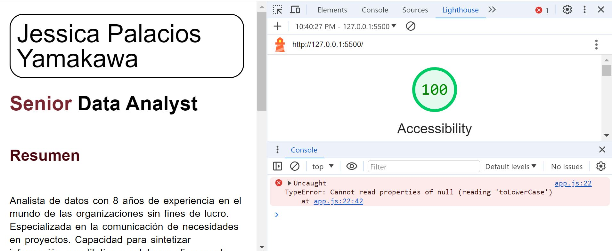

# Lab 02

## About me

Contruí una página web “About me”, con un cuestionario para el usuario sobre datos curiosos y dándole información acerca de mi. 

Luego le hago preguntas al usuario de tipo sí o no.

### Autor: Jessica Palacios Yamakawa

### Enlaces y Recursos

* https://entertechschool.github.io/code-201-guide/curriculum/class-02/README-template.html
* (https://entertechschool.github.io/code-201-guide/curriculum/class-02/project-setup)

### Puntuación de Accesibilidad de Lighthouse

* 

### Reflexiones y Comentarios

* Este laboratorio ha sido muy interesante y divertido.
